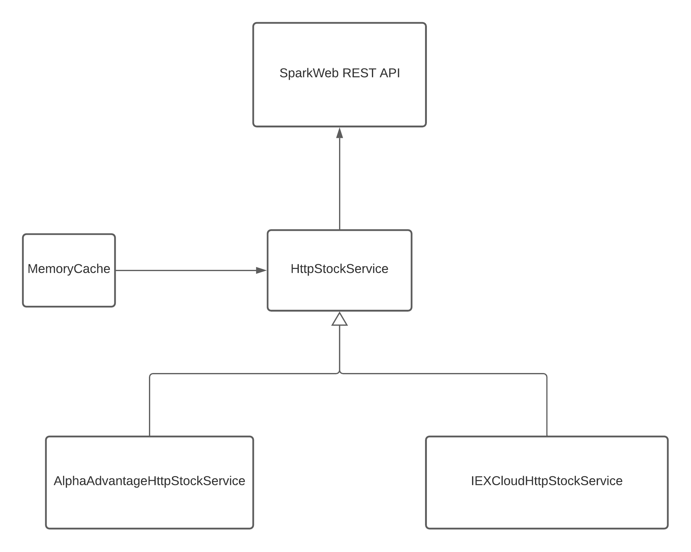
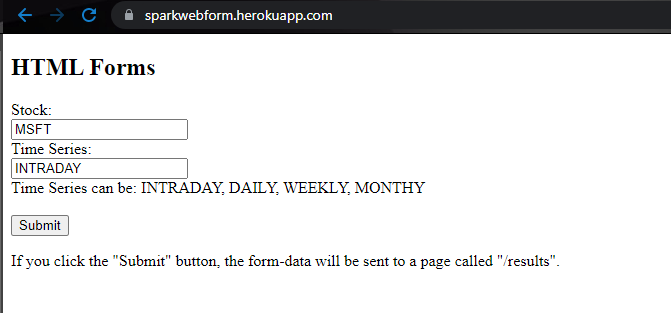
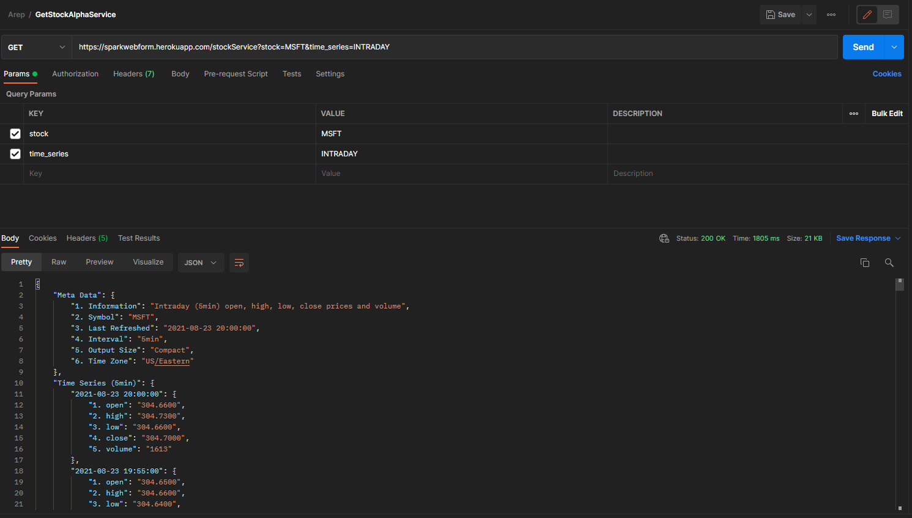
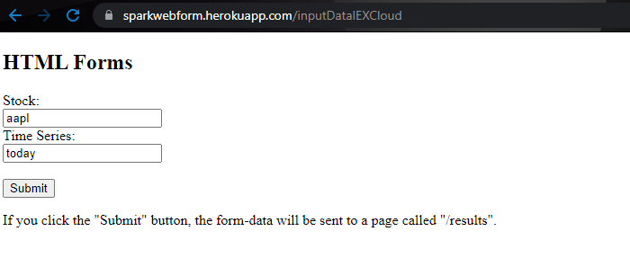
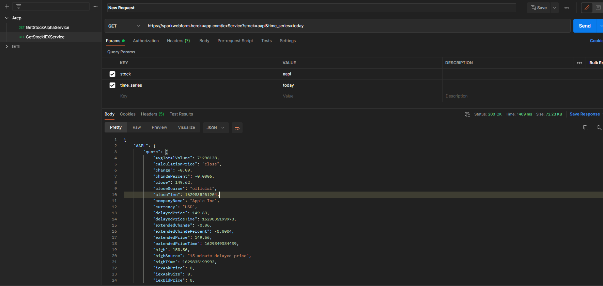

# Stock Consultant Assistant

Aplicación que utiliza Heroku para desplegar un asistente para consultar las distintas acciones que tiene cada empresa ya sean diarias, semanales, mensuales o a través del día. Para esto se utilizan 2 API, las cuales nos suministran dicha información para que posteriormente se le otorgue al usuario.


## Instrucciones de uso

### Prerrequisitos
- Git version 2.25.1
- Apache Maven version: 3.6.3
- Java versión: 1.8.0
- Spark version: 2.9.3

## Ejecución
Para poder usar el proyecto desde tu maquina local debes clonar el proyecto subido en Github utilizando el siguiente comando desde una terminar que cuente con Git:
```
https://github.com/Desarik98/SparkWebHerokuPrimer
```
Luego de clonar el proyecto, por medio de la terminal se debe ejecutar el siguiente comando para generar las dependencias necesarias y poder ejecutar el proyecto, para esto es necesario tener instalado  **Maven**
```
mvn package
```
A continuación, para ejecutar el programa se debe ejecutar el siguiente comando desde la terminal en el directorio del proyecto clonado

**Linux**
```
java -cp "target/classes:target/dependency/*" edu.escuelaing.arep.App
```
**Windows**
```
java -cp "target/classes;target/dependency/*" edu.escuelaing.arep.App
```
Podrá probar su funcionamiento a traves de la direccion http://localhost:8080

## Diagrama de clases



* **SparkWeb REST API:** controlador Spark que maneja las peticiones de la API.
* **HttpStockService:** servicio que se encarga de recibir los request que son enviados por medio del controlador y los conecta con los servicios AlphaAdvantageHttpStockService y IEXCloudHttpStockService.
* **Memory Cache:** clase que implementa una memoria cache de tipo llave, valor la cual tendrá guardados los responses generados por el servicio de HttpStockService para agilizar su consulta, esta memoria se borrara automáticamente después de 5 segundos.
* **AlphaAdvantageHttpStockService:** clase que retorna la url del api alphaadvantage.
* **IEXCloudHttpStockService:** clase que retorna la url del api IEXCloud

## Pruebas de Usuario

### Servicio de AlphaAdvantage
Para comprobar el funcionalidad se debe dirigir al link https://sparkwebform.herokuapp.com/ en donde encontrará la siguiente HomePage:



En donde se encontrarán 2 campos para rellenar, en el primero colocaremos la empresa sobre la cual quisiéramos saber el valor de su accion por ejemplo en este caso se utilizo MSFT (Microsoft), y en el segundo colocaremos el histórico de su valoración, puede tomar los valores:
- INTRADAY
- DAILY
- WEEKLY
- MONTHLY


  A continuación se le dará a submit para que nos muestre los resultados, se recomienda el uso de Postman para observar de una manera mas organizada los datos, como se muestra en pantalla.
  

### Servicio de IEXCloud



También podrá utilizar el servicio de IEXCloud dirigiéndose a la siguiente link https://sparkwebform.herokuapp.com/inputDataIEXCloud, en el cual encontrara exactamente el mismo formato que el servicio de AlphaAdvantage pero en esta ocasión el segundo campo tendrá los valores:

- today
- yesterday
- last-week
- last-month
- yrd (año actual)

A continuación se le dará a submit para que nos muestre los resultados, se recomienda el uso de Postman para observar de una manera mas organizada los datos, como se muestra en pantalla.


## Tecnologias
- Maven
- Java
- Spark
- AlphaAdvantage
- IEXCloud
- Heroku

## Autor
* Daniel Alejandro Mejía Rojas - Fecha: 24/08/2021

## Licencia
This project is licensed under the MIT License - see the LICENSE file for details